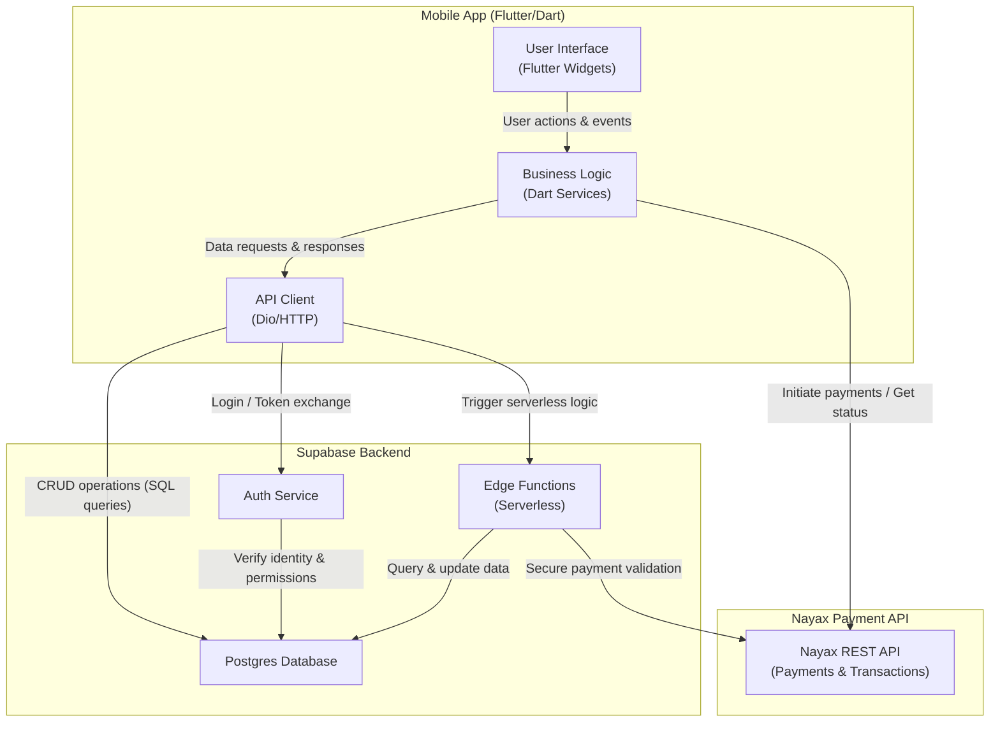

# Architecture

## Modules
### Mobile App (Flutter/Dart)
- User Interface (Flutter Widgets): Handles rendering of screens, navigation, and user interactions.
- Business Logic (Dart Services): Encapsulates application rules, state management, validation, and coordinates data flow between UI and backend services.
- API Client (Dio/HTTP): Manages network communication, sending requests and receiving responses from Supabase and the Nayax API.

### Supabase Backend
- Postgres Database: Stores structured data such as user profiles, app entities, and transaction records.
- Auth Service: Provides secure authentication, authorization, and user identity management.
- Edge Functions (Serverless): Executes custom backend logic like payment validation, data transformations, and secure workflows.

### Nayax Payment API
- Nayax REST API (Payments & Transactions): Handles financial transactions, including payment initiation, processing, and verification, ensuring secure integration with external payment systems.
