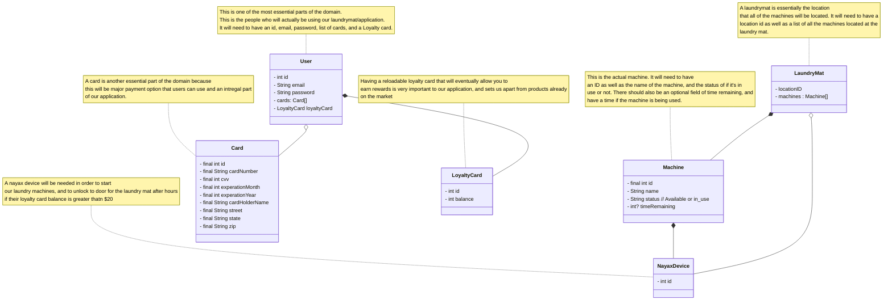

```mermaid
classDiagram
direction TB
    class LaundryMat {
	    - locationID
	    - machines : Machine[]
    }

    class Machine {
	    - final int id
	    - String name
	    - String status // Available or in_use
	    - int? timeRemaining
    }

    class User {
	    - int id
	    - String email
	    - String password
	    - cards: Card[]
	    - LoyaltyCard loyaltyCard
    }

    class Card {
	    - final int id
	    - final String cardNumber
	    - final int cvv
	    - final int experationMonth
	    - final int experationYear
	    - final String cardHolderName
	    - final String street
	    - final String state
	    - final String zip
    }

    class LoyaltyCard {
	    - int id
	    - int balance
    }

    class NayaxDevice {
	    - int id
    }

	note for LaundryMat "A laundrymat is essentially the location
    that all of the machines will be located. It will need to have a
    location id as well as a list of all the machines located at the
    laundry mat."

	note for Machine "This is the actual machine. It will need to have
    an ID as well as the name of the machine, and the status of if it's in
    use or not. There should also be an optional field of time remaining, and 
    have a time if the machine is being used."

	note for User "This is one of the most essential parts of the domain.
    This is the people who will actually be using our laundrymat/application.
    It will need to have an id, email, password, list of cards, and a Loyalty card."
	note for Card "A card is another essential part of the domain because
    this will be major payment option that users can use and an intregal part
    of our application."

	note for LoyaltyCard "Having a reloadable loyalty card that will eventually allow you to
    earn rewards is very important to our application, and sets us apart from products already
    on the market"

	note for NayaxDevice "A nayax device will be needed in order to start
    our laundry machines, and to unlock to door for the laundry mat after hours
    if their loyalty card balance is greater thatn $20"

    LaundryMat *-- Machine
    User o-- Card
    User *-- LoyaltyCard
    Machine *-- NayaxDevice
    LaundryMat o-- NayaxDevice

```
